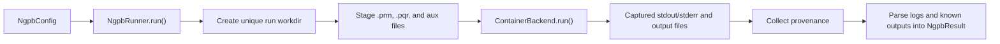

# Architecture

## Package Layout

- `ngpb4py.config`: NextGenPB parameter schema, validation, and `.prm` rendering
- `ngpb4py.runner`: run orchestration, staging, cleanup, and provenance
- `ngpb4py.container`: container execution helpers and backend implementation
- `ngpb4py.io.prm`: `.prm` parsing and rendering helpers
- `ngpb4py.io.logs`: structured parsing for log sections
- `ngpb4py.result`: result model and parsed output-file helpers

## Execution Flow

## Container Execution Contract

`ContainerBackend.run()` returns an `ExecutionResult` with:

- the effective `command`
- paths to captured `stdout` and `stderr`
- any discovered `output_paths`
- an optional `container_digest`

This keeps orchestration, parsing, and provenance in `NgpbRunner` while
allowing the container runtime and image to vary by environment.

## Container Backend Notes

The container backend:

- auto-detects `apptainer`, `singularity`, or `docker`
- downloads and caches remote SIF images for Apptainer-like runtimes
- mounts the run directory into the container
- captures stdout and stderr to files in the run directory

If Apptainer is requested and not installed, the backend includes an
interactive auto-install path intended for local developer environments.

## Documentation Boundaries

`ngpb4py` mirrors the NextGenPB parameter file and validates
known parameter types, but it does not attempt to model every possible 
solver option or every output format. The wrapper documentation
covers:

- the Python API and its behavior
- the files and log sections parsed by the wrapper
- container runtime and image configuration

For solver-specific scientific semantics and full input modeling, refer to the
upstream NextGenPB project and tutorial.
