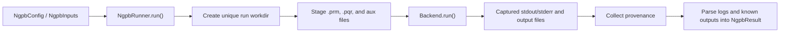

# Architecture

## Package Layout

- `ngpb4py.config`: parameter schema, validation, and `.prm` rendering
- `ngpb4py.inputs`: staged input-file representation
- `ngpb4py.runner`: run orchestration, staging, cleanup, and provenance
- `ngpb4py.backends`: execution backend protocol and container backend
- `ngpb4py.io.prm`: `.prm` parsing and rendering helpers
- `ngpb4py.io.logs`: structured parsing for documented log sections
- `ngpb4py.result`: result model and parsed output-file helpers

## Execution Flow

## Backend Contract

Custom backends should implement the `NgpbBackend` protocol and return an
`ExecutionResult` with:

- the effective `command`
- paths to captured `stdout` and `stderr`
- any discovered `output_paths`
- an optional `container_digest`

This keeps orchestration, parsing, and provenance in `NgpbRunner` while letting
execution vary by environment.

## Container Backend Notes

The built-in container backend:

- auto-detects `apptainer`, `singularity`, or `docker`
- downloads and caches remote SIF images for Apptainer-like runtimes
- mounts the run directory into the container
- captures stdout and stderr to files in the run directory

If Apptainer is requested and not installed, the backend includes an
interactive auto-install path intended for local developer environments.

## Documentation Boundaries

`ngpb4py` does not attempt to document every NextGenPB parameter or every solver
output format. The wrapper documentation covers:

- the Python API and its behavior
- the files and log sections parsed by the wrapper
- extension points for execution backends

For solver-specific scientific semantics and full input modeling, refer to the
upstream NextGenPB project and tutorial.
